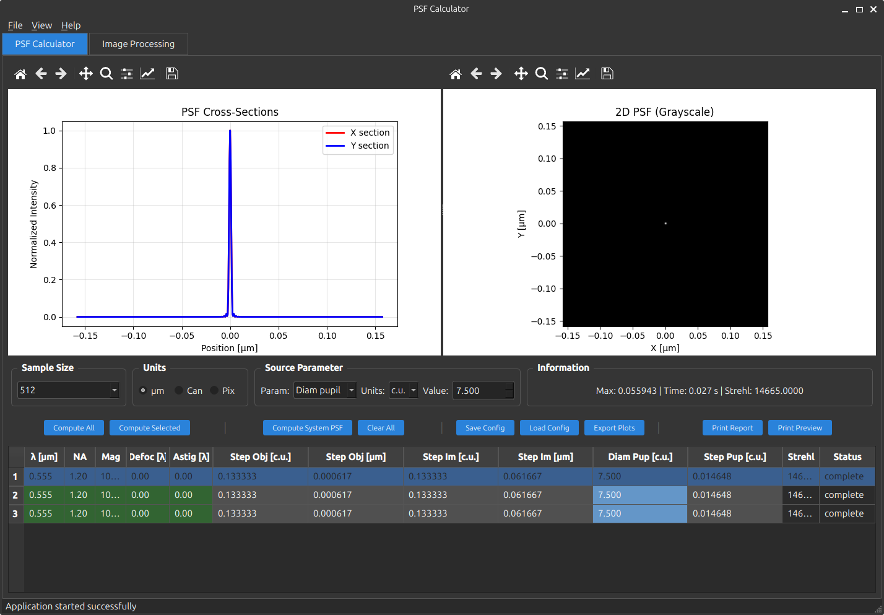
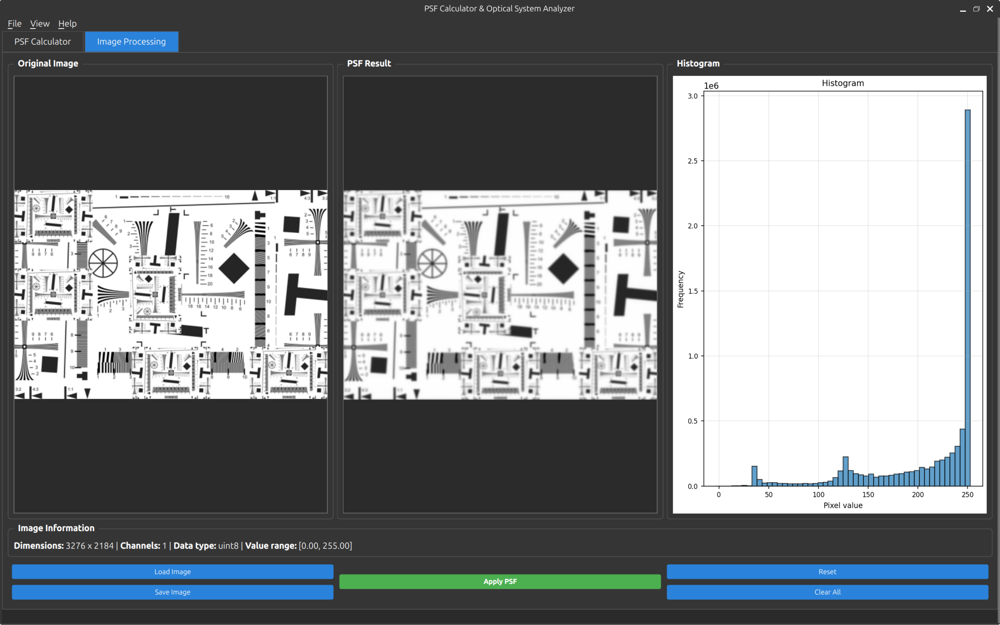

# PSF Calculator

расчет функции рассеяния точки (PSF) и применение к изображениям

## что умеет

- считать PSF с разными параметрами
- показывать графики PSF
- применять размытие к картинкам
- чистый python

## установка

```bash
pip install -r requirements.txt
python3 main.py
```

## скрины

### PSF Calculator


тут считается PSF с настройкой параметров

### Image Processing


тут применяем PSF к картинкам

## параметры PSF

- размер выборки
- длина волны
- апертура
- увеличение
- расфокусировка
- астигматизм
- охват зрачка

## зависимости

- PyQt6 - интерфейс
- NumPy - вычисления
- SciPy - свертка
- Matplotlib - графики
- Pillow - картинки
